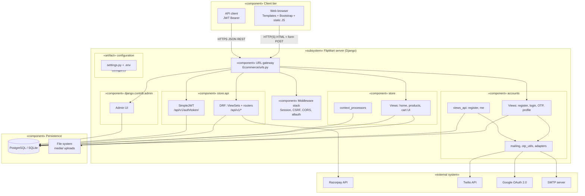

# FlipMart — Component diagram

UML-style **component view** of the FlipMart eCommerce system: subsystems, components, and dependencies.

> Also embedded in [UML_DIAGRAMS.md §2](UML_DIAGRAMS.md#2-component-diagram-uml-style) with the rest of the UML set.

---

## Diagram (Mermaid)

---

## Component inventory

| Component | Responsibility | Key paths |
|-----------|----------------|-----------|
| **URL gateway** | Route HTTP to apps | `Ecommerce/urls.py` |
| **accounts** | User model, registration, activation, password reset, OTP, profile, allauth adapters | `accounts/` |
| **accounts API** | JWT-adjacent register / `me` | `accounts/views_api.py`, `accounts/api_urls.py` |
| **store** | Product pages, cart/wishlist/checkout templates | `store/views.py`, `store/urls.py` |
| **store.api** | REST catalog, cart, orders, payments, reviews | `store/api/` |
| **Admin** | Staff CRUD, bank transfer confirmation | `store/admin.py`, `accounts/admin.py` |
| **Middleware** | Session, CSRF, CORS, allauth account middleware | `settings.py` `MIDDLEWARE` |
| **Persistence** | ORM models, migrations | `accounts/models.py`, `store/models.py` |

---

## External systems

| System | Used for |
|--------|----------|
| **PostgreSQL / SQLite** | Primary data store |
| **SMTP** | Transactional email (activation, OTP, orders) |
| **Twilio** | SMS OTP (optional) |
| **Google OAuth** | Social login (django-allauth) |
| **Razorpay** | Online payments |
| **Local media FS** | Product/category/user images |

---

## How to render

- **GitHub / GitLab**: open this `.md` file (native Mermaid).
- **VS Code**: Markdown preview with a Mermaid extension.
- **Export PNG/SVG**: [mermaid.live](https://mermaid.live) — paste the fenced `mermaid` block.

