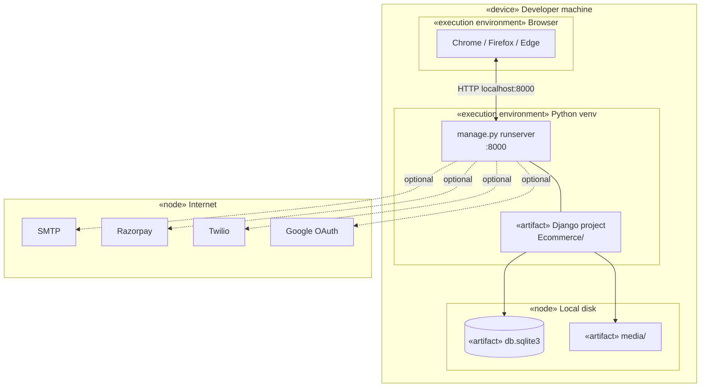
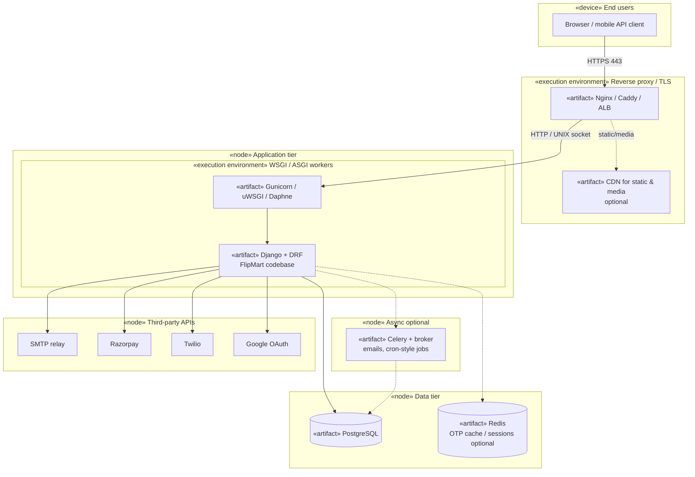

# FlipMart — Deployment diagram (UML)

UML **deployment view**: **nodes** (hardware or execution environments), **artifacts** (deployable software), and **communication paths**.

> Also in [UML_DIAGRAMS.md §6](UML_DIAGRAMS.md#6-deployment-diagram-uml).

---

## 1. Local development



---

## 2. Production (reference architecture)



---

## 3. Node and artifact inventory

| «node» / environment | Hosts these artifacts |
|----------------------|------------------------|
| **Developer PC** | Browser, Python venv, `runserver`, SQLite file, `media/` |
| **Edge (Nginx)** | TLS termination, static file serving or redirect to CDN |
| **App server** | Gunicorn/uWSGI, Django WSGI application |
| **Database server** | PostgreSQL (schemas: django + app tables) |
| **Redis** (optional) | Cache backend for OTP rate limits, sessions |
| **Worker** (optional) | Celery: `send_mail`, `refresh_order_tracking` at scale |
| **Object storage** (optional) | `MEDIA_ROOT` offload (S3-compatible) |
| **Internet** | Razorpay, Twilio, Google OAuth, SMTP |

---

## 4. Environment → configuration mapping

| Deployment concern | Configure via |
|--------------------|----------------|
| DB host | `DATABASES` / `DB_*` in `.env` |
| Secret key | `DJANGO_SECRET_KEY` |
| Allowed hosts / CSRF | `ALLOWED_HOSTS`, `CSRF_TRUSTED_ORIGINS` |
| Static | `collectstatic` + Nginx alias or Whitenoise |
| Media | `MEDIA_ROOT` or django-storages |
| HTTPS | Proxy sets `X-Forwarded-Proto`; `SECURE_SSL_REDIRECT` |

---

## 5. Minimal production command sketch

```bash
# Build static assets
python manage.py collectstatic --noinput

# Run app (example: 4 workers)
gunicorn Ecommerce.wsgi:application --bind 0.0.0.0:8000 --workers 4
```

Nginx forwards `location /` to `http://127.0.0.1:8000` and serves `/static/` from `STATIC_ROOT`.

---

## Render / export

Paste any diagram into [mermaid.live](https://mermaid.live) for PNG or SVG.
