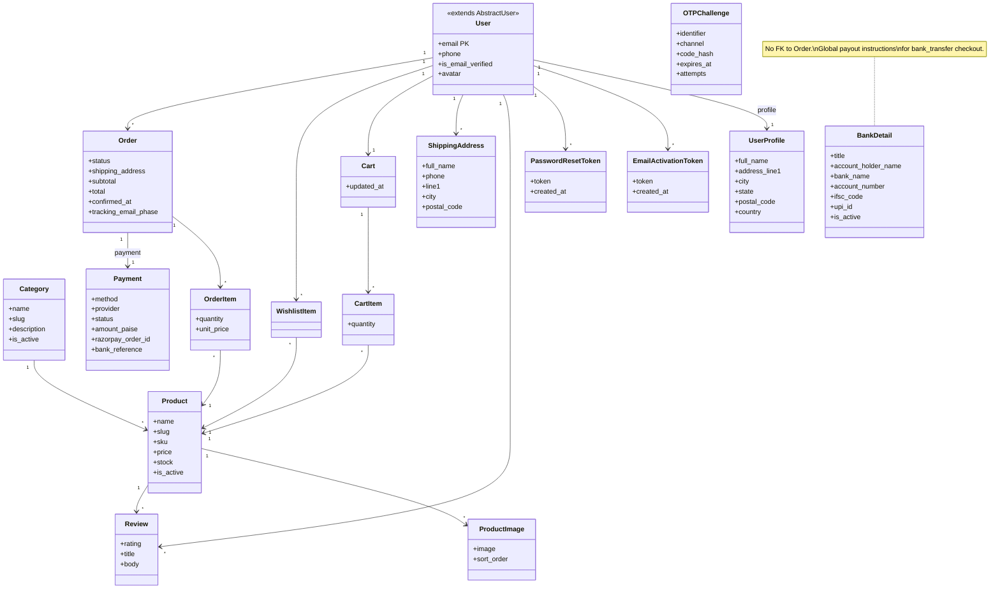
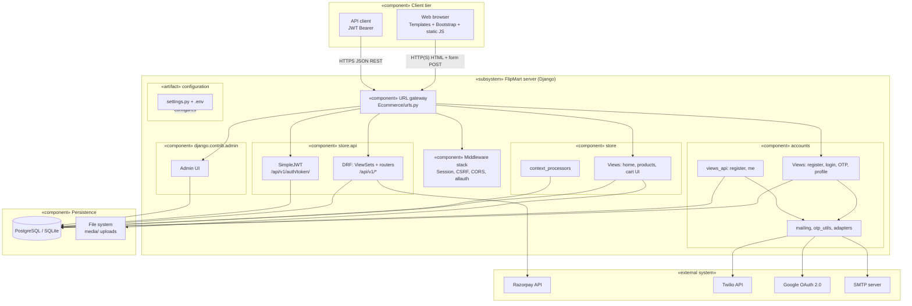
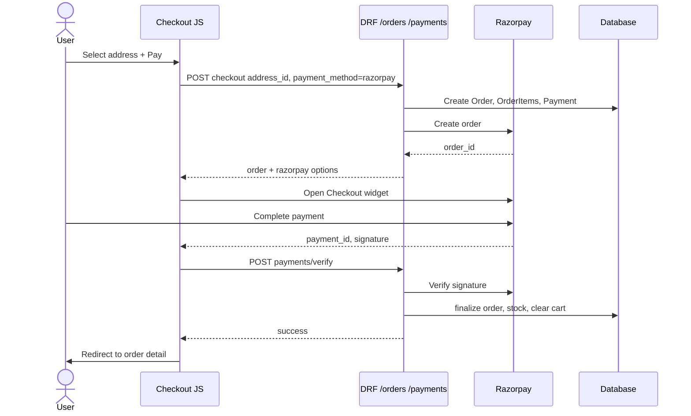
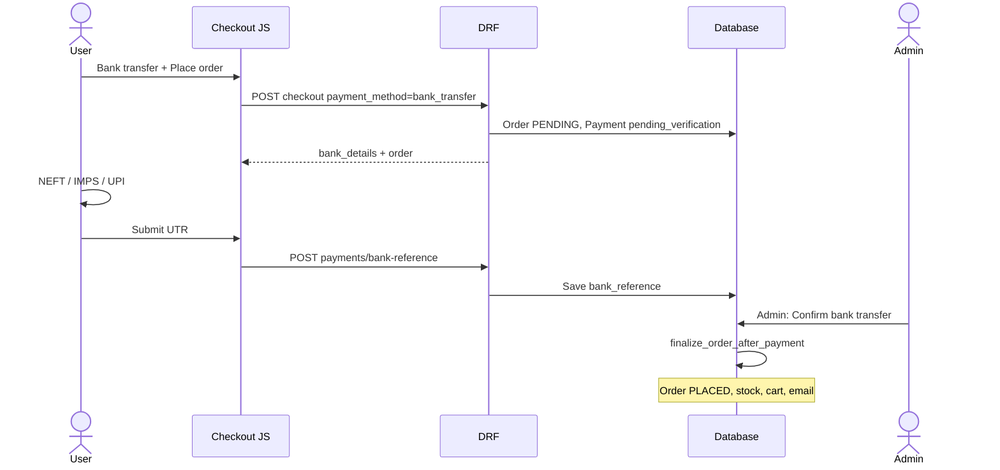
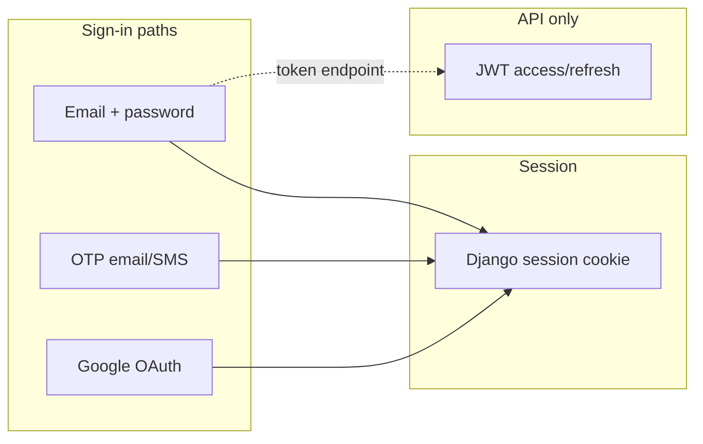
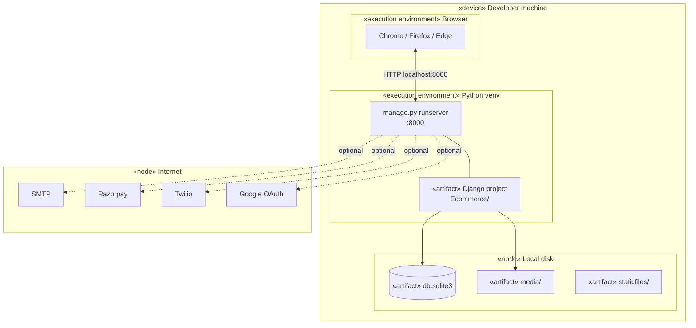
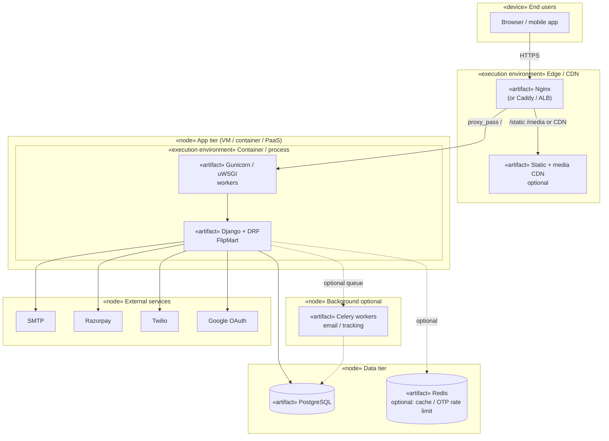

# FlipMart — UML diagrams

Diagrams use [Mermaid](https://mermaid.js.org/) (renders on GitHub, many IDEs, and Markdown previewers).

---

## 1. Domain model — class diagram (Django ORM)

`User` extends Django’s **`AbstractUser`** (fields such as `is_staff`, `is_active`, `date_joined` are inherited; **`username` is removed** — login is **`email`**).

---

## 2. Component diagram (UML-style)

Shows **software components**, **dependencies** (labeled arrows), and **external systems**.

**Dependency summary**

| From | To | Interface / protocol |
|------|-----|----------------------|
| Web browser | URL gateway | HTTP(S), cookies, CSRF |
| API client | URL gateway | HTTPS JSON, `Authorization: Bearer` |
| accounts | SMTP / Twilio / Google | Email, SMS, OAuth |
| store.api | Razorpay | HTTPS REST (server-side) |
| Django apps | Database | ORM → SQL |
| store | File system | `MEDIA_ROOT` uploads |

Full component inventory: [COMPONENT_DIAGRAM.md](COMPONENT_DIAGRAM.md).

---

## 3. Checkout and payment — sequence diagram (Razorpay)

---

## 4. Bank transfer checkout — sequence diagram

---

## 5. Authentication options (conceptual)

---

## 6. Deployment diagram (UML)

**Nodes** = execution environments or devices; **artifacts** = deployable pieces; dashed lines = optional.

### 6.1 Local development

### 6.2 Production (typical)

**Deployment notes**

| Artifact | Typical location |
|----------|------------------|
| Django app | App server (Gunicorn), immutable image in K8s/ECS |
| `STATIC_ROOT` | Nginx volume, S3 + CloudFront, Whitenoise |
| `MEDIA_ROOT` | Object storage (S3, GCS) with signed URLs |
| `SECRET_KEY`, DB URL | Env vars / secrets manager (not in image) |

Full node list and checklists: [DEPLOYMENT_DIAGRAM.md](DEPLOYMENT_DIAGRAM.md).

---

## Exporting to PNG/SVG

- [Mermaid Live Editor](https://mermaid.live) — paste a diagram and export.
- VS Code: “Markdown Preview Mermaid Support” or similar extensions.
- CLI: `@mermaid-js/mermaid-cli` (`mmdc -i file.mmd -o out.png`).

---

*Diagrams reflect the FlipMart codebase under `accounts/` and `store/`.*
