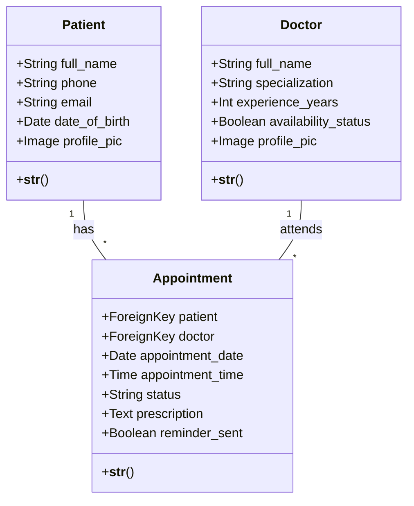
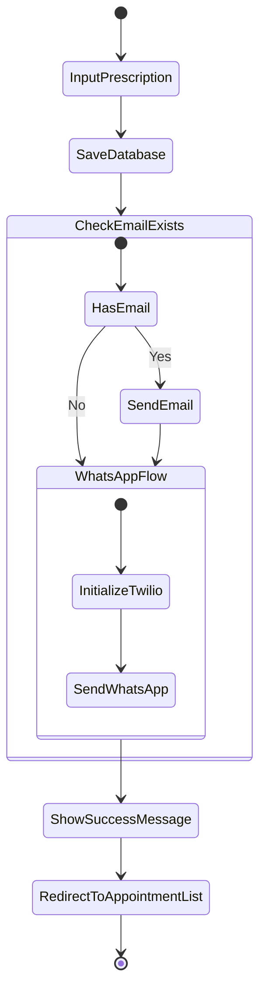

# Hospital Management System - UML Documentation

## 1. Use Case Diagram
This diagram describes the functional requirements of the system and the actors involved.

**Actors:**
- **Admin/Staff:** Manages patient records, doctor availability, and appointments.
- **Doctor:** Views history and provides prescriptions.
- **System:** Handles automated WhatsApp and Email notifications.

**Use Cases:**
- Register Patient
- Book Appointment
- View Medical History
- Add Prescription (Triggers WhatsApp/Email)
- Generate Reports
- Send Automated Reminders (via Management Command)

---

## 2. Class Diagram
This represents the static structure of the system based on `models.py`.

---

## 3. Object Diagram
This represents a specific instance of the system during runtime.

**Example Instance:**
- **objPatient1:** {full_name: "Rakesh", phone: "9133463364", email: "rakesh@mail.com"}
- **objDoctor1:** {full_name: "Dr. Smith", specialization: "Cardiology"}
- **objAppointment1:** {patient: objPatient1, doctor: objDoctor1, date: "2026-04-26", status: "Completed"}

---

## 4. Activity Diagram (Prescription & Notification Flow)
This tracks the logic within your `add_prescription` view in `views.py`.

---

## 5. System Sequence Diagram (Automated Reminders)
Based on your `send_reminders.py` management command and `send_whatsapp.bat`.

1. **Batch File** triggers the Management Command.
2. **Command** queries Database for appointments where `date == tomorrow` and `reminder_sent == False`.
3. **Command** loops through results.
4. **Command** calls **Twilio API** to send WhatsApp.
5. **Twilio** returns Success/Failure.
6. **Command** updates `reminder_sent = True` in Database.

---

## Technical Requirements
frontend : html,css,javascript
- **Framework:** Django 6.0.4
- **API:** Django REST Framework
- **Storage:** SQLite3
- **Communication:** Twilio (WhatsApp), SMTP (Email)